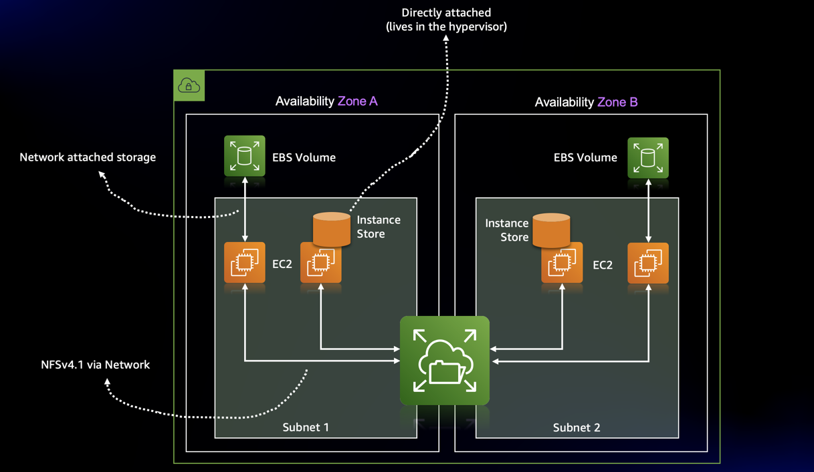
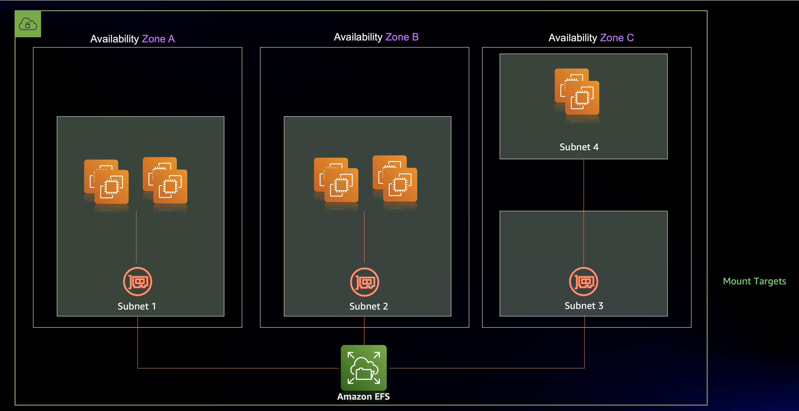
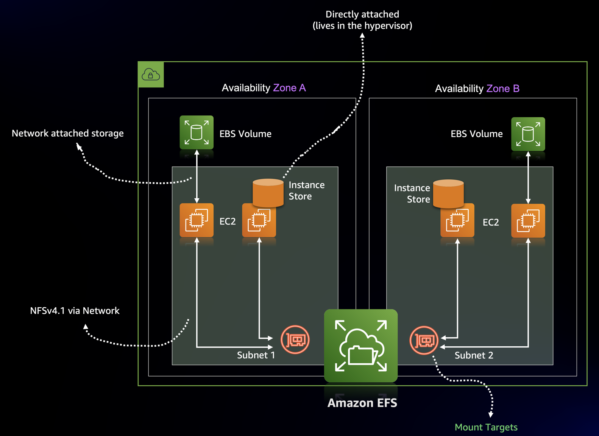

# Welcome to Amazon EFS Developer Zone

Welcome to Amazon Elastic File System(Amazon EFS) Developer Zone, your one shop store for all things around Amazon EFS and beyond. This page is intendent to all the builders who are new to Amazon EFS and would like to learn more about it. You will also get a better understanding of how Amazon EFS works with other AWS services and most importantly how you can leverage Amazon EFS for your application, wether it runs on virtual machine, container, or is completely serverless. 

## Introduction 

So, before we get started let's first spend sometime to understand what is Amazon EFS. Amazon EFS, launched in Jun 2016, is a simple, serverless, set-and-forget cloud-native, elastic file system designed to be consumed at scale from any AWS compute service, including container and serverless services like Amazon ECS, Amazon EKS, AWS Fargate and AWS Lambda. So, thats quite mouthsome, lets break it down, and start from the basics, Amazon EFS is a network share storage service which you can use to store your data for your application, which can be accessed by multiple compute services at the same time and is completely serverless. 

You can access Amazon EFS from:
- On-premise via 
    - Servier
    - Virtual Machine 
- Within AWS via
    - Amazon Elastic Compute Cloud (Amazon EC2)
    - Amazon Elastic Container Service (Amazon ECS)
    - Amazon Elastic Kubernetes Service (Amazon EKS)
    - AWS Fargate
    - AWS Lambda
    - Amazon SageMaker


So, if you are an application developer what this means to you is that, you can use Amazon EFS for:
- Mounting the EFS file system on your virtual machine and share the data across multiple virtual machine and use it as a `local storage`
- Your containerised application, e.g with Docker and use that as a `docker volume` 
- Your containerised application in your Kubernetes envionment as a `storageclass`. And the file system can be used by the application(pod) using a `PersistentVolumeClaim` object. 
- Your Machine Learning pipeline(`training` and `inference`), where your training dataset or model artifacts can be saved on this shared file system. 

The Amazon EFS file system is built to scale on demand to petabytes without disrupting applications. EFS is a fully-managed service that makes it easy to set up and scale file storage in the Amazon Cloud. And hence it provides elastic storage capacity with a pay for what you use scheme (in contrast to EBS with which you pay for what you provision). EFS is elastic and grows and shrinks as you add and remove data. 

## How Amazon EFS Works

Now, lets get dive deep and understand how it works. Let’s take a closer look at how Amazon EFS works, compared to Elastic Block Store (EBS) and the instance store. If we look at the image bellow, we will see that an EBS volume is tied to a data center (also called an AZ) and can only be attached over the network to a single EC2 instance from the same data center. Typically EBS volumes are used as the root volumes that contain the operating system, or for relational database systems to store the state. An instance store consists of a disk which directly attached to the hardware the EC2 instance is running on. An instance store can be regarded as ephemeral storage, and is therefore used for caching or for NoSQL databases with embedded data replication only. The data in an instance store persists only during the lifetime of its associated instance. If an instance reboots (intentionally or unintentionally), data in the instance store persists. However, data in the instance store is lost if the instance `stops or hibernates or terminates` or the underlying disck drive fails. 



In contrast, the EFS filesystem can be used by multiple EC2 instances(and any other compute resources like Amazon EKS, Amazon ECS, AWS Fargate, or AWS Lambda) from different availability zone within a region, across a region all in parallel. Additionally, Data is protected with high durability and availability within an Availability Zone and an AWS Region, with an optional functionality to replicate and protect the data across AWS Regions.

There are two main components to know about:
- `FileSystem` : Stores your data
- `Mount target` : Makes your data accessible

The filesystem is the resource that stores your data within a AWS region, but you can’t access it directly. To do so, you must create an EFS mount target in a subnet. The mount target provides a network endpoint that you can use to mount the filesystem on an EC2 instance via NFSv4.1. You can create one mount target in each Availability Zone in an AWS Region. If there are multiple subnets in an Availability Zone in your VPC, you create a mount target in one of the subnets. 




## Creating a File System

The filesystem is the resource that stores your files and directories. EFS grows with your storage needs. You don’t have to provision the storage up front. The filesystem is located in an AWS region and stores your data under the covers across multiple availability zones within that region.

You can create an EFS file system via, AWS Console, CLI, or API(via SDK). And here we will use CloudFormation to set up the filesystem now.
The bare minimum to describe a filesystem resource is shown here:

```yaml
Resources:
[...]

FileSystem:
    Type: 'AWS::EFS::FileSystem'
    Properties: {}                           <------ Nothing is needed to configure

```

Optionally, you can add tags to track costs or add other useful meta data with the `FileSystemTags` property.

## Create a mount target

An EFS mount target makes your data available to any compute resource via the NFSv4.1 protocol in a single AZ. Any compute resource communicates with the mount target via a TCP/IP network connection. And just like any other resource within AWS, you can control the access to your EFS File System using Security Groups. This Security group controls which traffic is allowed to enter the mount target. The NFS protocol uses port 2049 for inbound communication.



You can use CloudFormation to manage an EFS mount target. The mount target references the filesystem, needs to be linked to a subnet, and is also protected by at least one security group. You will first describe the security groups, followed by the mount target, as shown bellow:

```yaml

Resources:
[...]
EFSClientSecurityGroup:
    Type: 'AWS::EC2::SecurityGroup'
    Properties:
        GroupDescription: 'EFS Mount target client'
        VpcId: !Ref VPC
MountTargetSecurityGroup:
    Type: 'AWS::EC2::SecurityGroup'
    Properties:
        GroupDescription: 'EFS Mount target'
        SecurityGroupIngress:
            - FromPort: 2049
            - IpProtocol: tcp
            - SourceSecurityGroupId: !Ref EFSClientSecurityGroup
            - ToPort: 2049
    VpcId: !Ref VPC

MountTargetA:
    Type: 'AWS::EFS::MountTarget'
    Properties:
        FileSystemId: !Ref FileSystem
        SecurityGroups:
            - !Ref MountTargetSecurityGroup
        SubnetId: !Ref SubnetA

MountTargetB:
    Type: 'AWS::EFS::MountTarget'
    Properties:
        FileSystemId: !Ref FileSystem
        SecurityGroups:
            - !Ref MountTargetSecurityGroup
        SubnetId: !Ref SubnetB

```

## Application Integration of EFS with different compute resources 

In the section we will go over each and every compute resource and look at how Amazon EFS works with all different compute resources, lets start with traditional compute, and see how we can make use of Amazon EFS with Amazon EC2  

## Amazon EFS with Amazon EC2 instances

In this section we will see how we can make an Amazon EFS file system accessed from multiple Amazon EC2 instances. 

| Tutorial | Link
| --- | ---
| **Amazon EFS with Amazon EC2 instances** | [](/application-integration/ec2/README.md) |

## Amazon EFS with Serverless  

In this section we will dive into how you can setup Amazon EFS with AWS Lambda and other serverless services. 

| Tutorial | Link
| --- | ---
| **Amazon EFS with AWS Lambda and API Gateway** | [](/application-integration/serverless/efs-lambda-apigw) |
| **Media file processing using AWS Lambda and Amazon EFS** | [](/application-integration/serverless/media-file-processing) |
| **Machine Learning Inference using Amazon API Gateway, AWS Lambda and Amazon EFS** | [](https://github.com/aws-samples/ml-inference-using-aws-lambda-and-amazon-efs) |

## Amazon EFS with Container 

In this section we will dive into how you can setup Amazon EFS with Amazon ECS and Amazon EKS. 

| Tutorial | Link
| --- | ---
| **Static Provisioning using Amazon EFS for Amazon EKS** | [](/application-integration/container/eks/static_provisioning) |
| **Dynamic Provisioning using Amazon EFS for Amazon EKS** | [](application-integration/container/eks/dynamic_provisioning) |
| **Machine Learning at scale using Kubeflow on Amazon EKS with Amazon EFS** | [](/application-integration/container/eks/kubeflow) |


## AWS re:Invernt Sessions 

- [AWS re:Invent 2021 - Deep dive on Amazon EFS](https://www.youtube.com/watch?v=39bGVEgZcEE)
- [AWS re:Invent 2021 - Introducing the latest Amazon EFS performance optimizations](https://www.youtube.com/watch?v=4zruxPc6kAM)
- [AWS re:Invent 2021 - Introducing Amazon EFS Replication](https://www.youtube.com/watch?v=JziciVbsFY4&t=2286s)
- [AWS re:Invent 2021 - AWS storage solutions for containers and serverless applications](https://www.youtube.com/watch?v=4JPDOWXBUOs)
- [AWS re:Invent 2020: Security best practices with Amazon EFS](https://www.youtube.com/watch?v=tIK6BBo_9n0&t=111s)

## Security

See [CONTRIBUTING](CONTRIBUTING.md#security-issue-notifications) for more information.

## License

This library is licensed under the MIT-0 License. See the LICENSE file.


