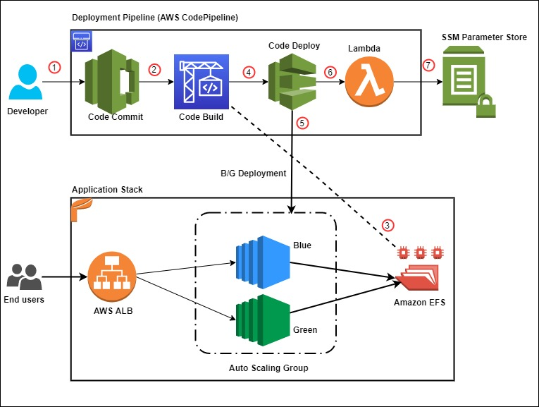

## Blue/Green deployment with AWS Developer tools on Amazon EC2 using Amazon EFS to host application source code

This Repo contains AWS Cloudformation template and required scripts to configure a fully automated CI/CD pipeline for performing a fully automated Blue/Green deployment on EC2 Instances using Amazon EFS to host source code.

This sample solution sets up a complete CI/CD pipeline for conducting a blue/green deployment on EC2 instances utilizing Amazon EFS file share as mount point to host application source code. The EFS share will be the central location hosting your application content, and it will help reduce your overall deployment time by eliminating the need for deploying a new revision on every EC2 instance local storage. It also helps to preserve any dynamically generated content when the life of an EC2 instance ends.

## How this solution works

Figure below illustrates our solution architecture.



The event flow is as follows:

- A developer commits code changes from their local repo to the CodeCommit repository. The commit triggers CodePipeline execution.
- CodeBuild execution begins to compile source code, install dependencies, run custom commands, and create deployment artifact as per the instructions in the Build specification reference file.
- During the build phase, CodeBuild copies the source-code artifact to Amazon EFS file system and maintains two different directories for current (green) and new (blue) deployments.
- After successfully completing the build step, CodeDeploy deployment kicks in to conduct a Blue/Green deployment to a new Auto Scaling Group.
- During the deployment phase, CodeDeploy mounts the EFS file system on new EC2 instances as per the CodeDeploy AppSpec file reference and conducts other deployment activities.
- After successful deployment, a Lambda function triggers in order to store a deployment environment parameter in Systems Manager parameter store. The parameter stores the current EFS mount name that the application utilizes.
- The AWS Lambda function updates the parameter value during every successful deployment with the current EFS location.

## Prerequisites

- An [AWS account](https://signin.aws.amazon.com/signin?redirect_uri=https%3A%2F%2Fportal.aws.amazon.com%2Fbilling%2Fsignup%2Fresume&client_id=signup)
- Access to an AWS account with administrator or PowerUser (or equivalent) [AWS Identity and Access Management(IAM)](http://aws.amazon.com/iam) role policies attached
- [Git Command Line](https://git-scm.com/book/en/v2/Getting-Started-Installing-Git) installed and configured in your local environment

## Deploy the solution

- Clone the GitHub repo and store the files on your local machine. Utilize the commands below to clone the repo:

    ```
      mkdir -p ~/blue-green-sample/
      cd ~/blue-green-sample/
      git clone https://github.com/aws-samples/blue-green-deployment-pipeline-for-efs
	``` 

Utilize the following steps to deploy the solution in your AWS account:

- Create a private Amazon Simple Storage Service (Amazon S3) bucket.
- Upload the cloned or downloaded GitHub repo files to the root of the S3 bucket. the S3 bucket objects structure.
- Go to the S3 bucket and select the template name solution-stack-template.yml, and then copy the object URL.
- Open the CloudFormation console. Choose the appropriate AWS Region, and then choose Create Stack.
- On the Specify stack details page, enter a name for the stack and provide the input parameter "ArtifactBucket".

## Security

See [CONTRIBUTING](CONTRIBUTING.md#security-issue-notifications) for more information.

## License

This library is licensed under the MIT-0 License. See the LICENSE file.